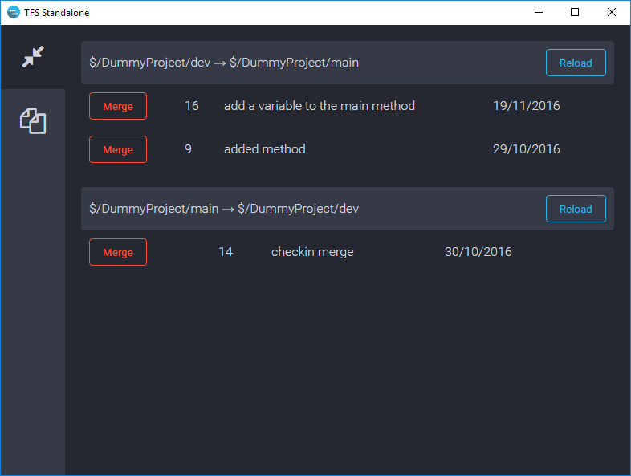
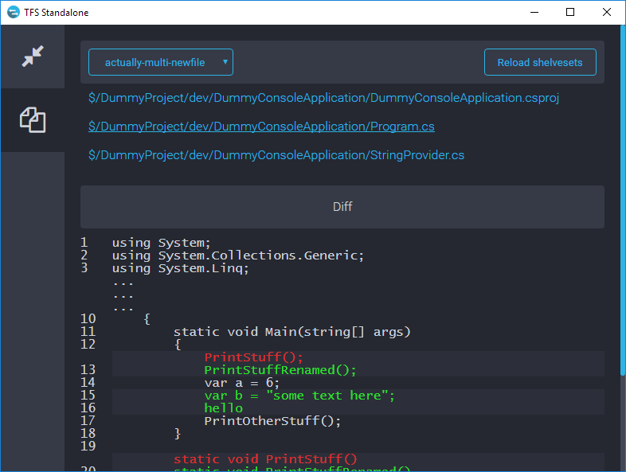

# TFS Standalone

A Windows app that aims to solve some of the annoying problems that come with using Team Foundation Server source control, such as:

 1. Merging multiple changes across several branches
 2. Comparing local changes to a shelveset
 

 
## Installation

 - Download and extract `Release.zip` 
 - Replace the values in `config.json` with info about your TFS project1
 - Run `TfsStandalone.UI.exe`
 
1`TfsStandalone.UI.exe` must be run under a Windows account that also has access to your TFS project. Otherwise, `altCredentials` must be provided - although storing your credentials in a text file is clearly a bad idea! In future releases, I intend to implement better authentication methods. All other config values are required.
 